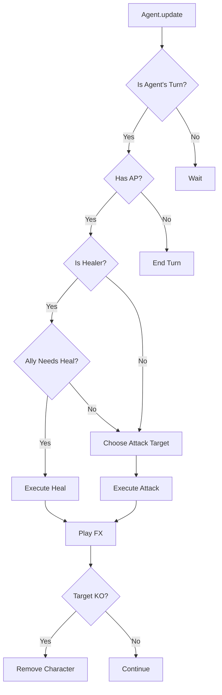

# Agent System Documentation

## Overview

The Agent system provides AI-controlled characters for BTAR-R, enabling automated gameplay and AI vs AI battles.

## Features

- **Team-based AI**: Agents control specific teams (green or red)
- **Multiple difficulty levels**: Easy, Normal, and Hard
- **Smart decision making**: 
  - Healers prioritize healing wounded allies
  - Attack targeting based on threat assessment
  - Range and AP management
- **Configurable behavior**: Adjustable think delay and difficulty
- **Toggle modes**: Enable/disable agents per team or both teams

## Usage

### In-Game Controls

- **[A] Key**: Toggle agent modes
  - `none` → Manual control for both teams
  - `green` → Green team AI-controlled
  - `red` → Red team AI-controlled
  - `both` → Full AI vs AI battle
  
- **[Space] Key**: Manually end turn (when controlling a team)

### Integration Example

```lua
local Agent = require "core.agent"

-- Create an agent for team 0 (green) with normal difficulty
local agentGreen = Agent.new(0, "normal")

-- Enable the agent
agentGreen.enabled = true

-- Update in game loop
function love.update(dt)
    agentGreen:update(dt, characters, state, removeCharacter, activeFX, registry)
end

-- Change difficulty
agentGreen:setDifficulty("hard")

-- Toggle on/off
agentGreen:toggle()
```

## Difficulty Levels

### Easy
- Random target selection
- Basic decision making
- No strategic prioritization

### Normal (Default)
- Targets closest enemy
- Considers range and positioning
- Healers prioritize wounded allies

### Hard
- Prioritizes weak/low HP targets
- Evaluates threat levels
- Optimizes target selection based on multiple factors
- Strategic healing threshold (< 60% HP)

## Agent Decision Logic

### Attack Priority (Hard Mode)
1. **In Range**: +50 score
2. **Low HP Target**: +(25 - enemy.hp) × 3
3. **Proximity**: -distance × 2
4. Selects target with highest score

### Healing Logic
1. Check if character is a healer
2. Verify sufficient AP (2 required)
3. Find most damaged ally
4. Heal if ally HP < 60% and in range

## Architecture



## API Reference

### Constructor

**`Agent.new(team, difficulty)`**
- `team`: 0 for green, 1 for red
- `difficulty`: "easy", "normal", or "hard" (default: "normal")
- Returns: Agent instance

### Methods

**`Agent:update(dt, characters, state, removeCharacterFn, activeFXTable, fxRegistry)`**
- Main update loop - call every frame
- Parameters:
  - `dt`: Delta time
  - `characters`: Table of all characters
  - `state`: GameState instance
  - `removeCharacterFn`: Function to remove defeated characters
  - `activeFXTable`: Table for FX effects
  - `fxRegistry`: Animation registry for FX

**`Agent:executeAction(character, characters, state, removeCharacterFn, activeFXTable, fxRegistry)`**
- Execute a single action for a character
- Returns: Result table with `ok` status and details

**`Agent:toggle()`**
- Toggle agent enabled/disabled

**`Agent:setDifficulty(difficulty)`**
- Change agent difficulty level
- `difficulty`: "easy", "normal", or "hard"

### Properties

- `enabled`: Boolean - whether agent is active
- `team`: Number - team ID (0 or 1)
- `difficulty`: String - current difficulty level
- `thinkTimer`: Number - internal timer for action delays
- `thinkDelay`: Number - seconds between actions (default: 0.5)

## Future Enhancements

- [ ] Pathfinding for movement
- [ ] Formation strategies
- [ ] Personality types (aggressive, defensive, balanced)
- [ ] Learning/adaptive AI
- [ ] Multi-unit coordination
- [ ] Special ability usage
- [ ] Retreat/repositioning logic

## Contributing

When modifying the agent system, ensure:
1. All difficulty levels remain balanced
2. Agents respect game rules (AP, range, etc.)
3. Think delays prevent frame-perfect actions
4. Healers don't waste actions on full HP allies
5. Dead characters are properly handled
